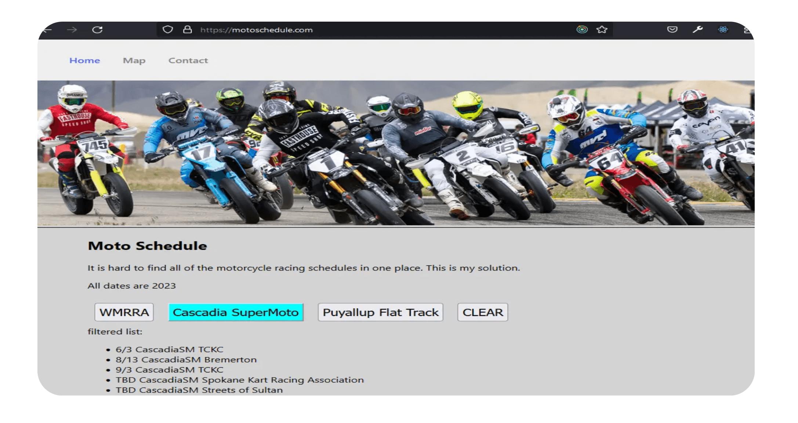

# MotoSchedule

This is a React appplication I made to bring together schedules from multiple places. It is hard to find all of the dates sometimes and this helps people. 

You can view it at https://motoschedule.com

## How It's Made:

**Tech used:** HTML, CSS, JavaScript, React, Redux

I started this site with just HTML, CSS and Javascript last year and this year I am converting it into a React-Redux-App. It was so cool to see how much better it became using modern techniques and refractoring my application. I did get stuck on passing state around with redux but everything is working fine now. 
